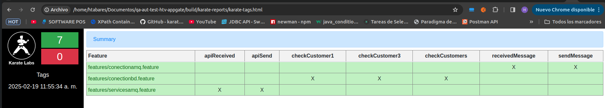

Plan de Pruebas para Validación de Clientes en Servicio de Detección de Phishing
Objetivo
• Diseñar, implementar y ejecutar un plan de pruebas para la funcionalidad de validación de clientes en el servicio de detección de phishing.
• Implementar la automatización de las pruebas utilizando Cucumber, Karate, y Java.
• Identificar escenarios borde o posibles bugs en la aplicación.
• Seguir las instrucciones del repositorio qa-automation-test-appgate.
Alcance
Este plan de pruebas abarca la validación de los clientes antes de procesar una URL sospechosa mediante la integración con RabbitMQ y PostgreSQL. Se evaluarán los siguientes criterios:
• El cliente debe existir en el sistema.
• El cliente debe estar en estado activo.
• El cliente debe tener el servicio de detección de phishing habilitado.
Criterios de Aceptación
• Se deben consumir mensajes desde RabbitMQ para validar clientes.
• Se debe consultar la base de datos PostgreSQL para validar la existencia y estado del cliente.
• Se deben manejar casos de clientes inactivos o sin servicio habilitado.
• La automatización debe ejecutarse sin errores y generar reportes de prueba.
Estrategia de Pruebas
Las pruebas se dividirán en los siguientes niveles:
• Pruebas de integración: Validar la conexión con RabbitMQ y PostgreSQL.
• Pruebas funcionales: Validar la lógica de negocio para la detección de phishing.
• Pruebas de regresión: Garantizar que nuevas implementaciones no rompan la funcionalidad existente.

Escenario 1: Cliente válido con servicio activo

Feature: Validación de Cliente para Detección de Phishing

Scenario: Cliente válido y activo puede procesar la URL
Given el cliente con ID "12345" existe en la base de datos
And el cliente está en estado "activo"
And el cliente tiene el servicio de detección de phishing habilitado
When se recibe un mensaje en la cola "testing.customer.query.is-customer-available"
And se consulta la base de datos para validar el cliente
Then el sistema responde que el cliente está habilitado para detección de phishing
And el mensaje se publica en la cola "testing.customer.response.is-customer-available"

Escenario 2: Cliente no existente

Scenario: Cliente no registrado en el sistema
Given el cliente con ID "99999" no existe en la base de datos
When se recibe un mensaje en la cola "testing.customer.query.is-customer-available"
And se consulta la base de datos para validar el cliente
Then el sistema responde que el cliente no está registrado
And el mensaje se publica en la cola "testing.customer.response.is-customer-available"

Escenario 3: Cliente inactivo

Scenario: Cliente en estado inactivo
Given el cliente con ID "54321" existe en la base de datos
And el cliente está en estado "inactivo"
When se recibe un mensaje en la cola "testing.customer.query.is-customer-available"
And se consulta la base de datos para validar el cliente
Then el sistema responde que el cliente no está habilitado
And el mensaje se publica en la cola "testing.customer.response.is-customer-available"

Escenario 4: Cliente sin servicio de detección de phishing

Scenario: Cliente sin servicio habilitado
Given el cliente con ID "56789" existe en la base de datos
And el cliente está en estado "activo"
And el cliente no tiene el servicio de detección de phishing habilitado
When se recibe un mensaje en la cola "testing.customer.query.is-customer-available"
And se consulta la base de datos para validar el cliente
Then el sistema responde que el cliente no tiene el servicio habilitado
And el mensaje se publica en la cola "testing.customer.response.is-customer-available"

evidencias de ejecuciones

